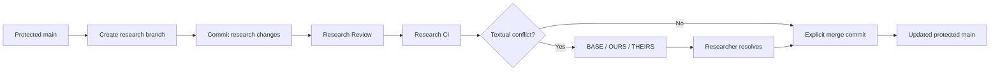
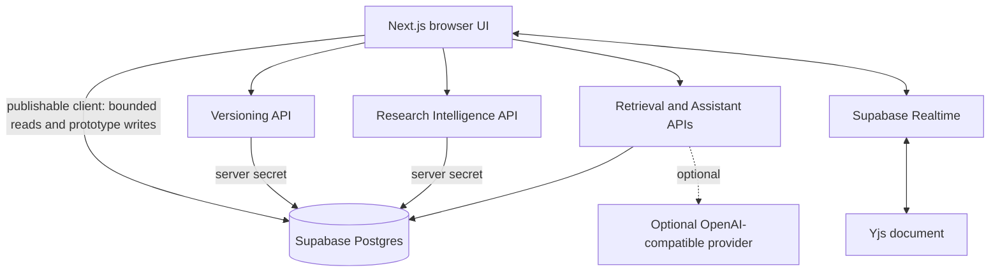

# Git for Research

**Version control for research knowledge—not just research files.**

> **Git tracks how files evolve. We track how knowledge evolves.**

Git for Research turns Markdown notes, text-extractable PDFs, and ChatGPT exports into a branchable research repository. It combines immutable versions and deterministic merge semantics with claim-aware review, evidence provenance, historical retrieval, and a repository-grounded Assistant.

It is not a generic editor, standalone chatbot, RAG wrapper, or research dashboard. The product is designed around one question: **how did the knowledge in this repository change?**

[🚀 **Live Demo**](https://git-for-research.vercel.app/) · [💻 **GitHub Repository**](https://github.com/CodedStars-hub/git-for-research)

   

## The problem

Research rarely lives in one place. It is fragmented across Markdown notes, PDFs, AI conversations, experiments, evolving hypotheses, and multiple researchers.

Traditional file history can show that text changed. Research teams need more:

- What knowledge changed, and between which versions?
- Which evidence supports a claim?
- What conclusions depend on that claim?
- Did parallel work introduce contradictory conclusions?
- What changed while a researcher was away?
- Is a branch ready to enter the canonical research record?

## The core insight

Software version control operates on code changes. Research version control must also reason about **evidence, claims, hypotheses, conclusions, provenance, and contradictions**.

> Two researchers can edit completely different lines and still create contradictory knowledge.

Git for Research keeps commits, branch pointers, snapshots, textual diffs, and merges deterministic. Research-aware heuristics surface claim changes, missing support, numerical changes, possible contradictions, and downstream impact—but they never silently decide which claim is true. **The researcher remains the decision-maker.**

## What makes it different

| Capability | What Git for Research does |
| --- | --- |
| Versioned research artifacts | Ingests Markdown/plain text, extracts text from PDFs server-side, and imports ChatGPT JSON exports. |
| Immutable research history | Stores append-only artifact versions, commits, and complete commit snapshots. |
| Branching | Treats a branch as a movable commit pointer so alternate hypotheses can evolve independently. |
| Textual + Knowledge Diff | Shows deterministic document changes alongside introduced, removed, modified, and numerical claim changes. |
| Three-way research merge | Finds a common ancestor and presents deterministic `BASE / OURS / THEIRS` conflicts for explicit resolution. |
| Protected `main` | After the initial commit, direct content commits to `main` are blocked; reviewed merges require current heads and a complete Research CI run. |
| Research Reviews | Provides a pull-request-style comparison between an exact source head and target head, with an optional recorded decision reason. |
| Research CI | Runs six integrity checks before protected research enters `main`. |
| Evidence and provenance | Links extracted claims to immutable artifact versions and authentic source text. |
| Evidence Blast Radius | Traverses stored claim dependencies—with cycle protection—to surface directly and downstream affected conclusions. |
| Historical retrieval | Searches current and prior artifact versions and preserves commit provenance in results. |
| Repository-aware Assistant | Answers from the selected workspace and branch, cites current or historical evidence, and retains bounded multi-turn context. |
| Insufficient-evidence behavior | Returns an explicit insufficient-grounding response instead of manufacturing repository facts. |
| Live collaboration | Uses Yjs with Supabase Realtime for concurrent Markdown editing and live Presence. |
| What changed since I left? | Compares the current branch head with the last head recorded for that demo researcher and summarizes intervening commits and artifact changes. |
| Repository settings | Supports safe workspace renaming and exposes truthful repository, protection, and live-collaboration information. |

## Research CI

Software CI asks whether code builds and tests pass. **Research CI asks whether a research change is ready for human review.**

The implemented pipeline runs six checks:

| Check | What it surfaces |
| --- | --- |
| Textual merge safety | Deterministic merge conflicts that must be resolved. |
| Supporting evidence | New or modified claims without a meaningful independent evidence match. |
| Numerical change | Related claims whose reported numerical values changed. |
| Provenance | Whether extracted claims retain their artifact and immutable version source. |
| Possible contradiction | Shared topics with negating language or materially different numerical statements. |
| Blast radius | Stored downstream claim dependencies affected by changed claims. |

The status model is deliberately simple:

- 🟢 **Green:** the check passed.
- 🟠 **Amber:** an advisory research warning requires researcher judgment.
- 🔴 **Red:** a deterministic blocking problem, such as an unresolved textual conflict.

> Research CI does not declare a claim true or false. It identifies where human judgment is required before knowledge enters `main`.

## Merge and conflict model



The merge engine walks both commit parents to find a common ancestor, builds `BASE`, `OURS`, and `THEIRS` snapshots, and uses deterministic three-way text merging. An unresolved textual conflict blocks completion. Semantic and contradiction warnings remain advisory; the final merge is always an explicit researcher action.

## Example: why this matters

Consider two lines of research derived from the same base:

- **Base:** “Redis should not be adopted until production validation is complete.”
- **Branch A:** keeps production validation as a requirement.
- **Branch B:** recommends adoption from revised benchmark evidence.

Git for Research can:

1. identify the divergent commit histories;
2. show textual changes and changed claims;
3. flag deterministic textual conflicts where edits overlap;
4. surface possible contradictory or numerical conclusions as advisory warnings;
5. present `BASE / OURS / THEIRS` when resolution is required; and
6. record the researcher’s explicit merge commit in repository history.

The system surfaces the disagreement. It does not decide whether Redis should be adopted.

## Grounded Research Assistant

The Assistant is a view over repository evidence, not an omniscient chatbot.

- It uses the selected workspace, branch, and current commit snapshot.
- It retrieves across Markdown, extracted PDF text, ChatGPT exports, and historical artifact versions.
- Citations retain artifact, immutable version, current/historical status, and associated commit provenance.
- Bounded multi-turn context supports follow-up questions.
- Responses expose grounding mode, confidence, limitations, and inspectable citations.
- An optional model provider may synthesize an answer, but the result is discarded if its citations fail validation.
- Without a configured provider, the deterministic grounded response remains fully functional.

For example, the demo repository can distinguish an earlier Redis benchmark from a revised result. Ask about an unrelated topic such as Kubernetes, and the Assistant reports insufficient repository evidence rather than inventing an answer.

## Architecture



Deterministic repository mechanics live separately from research interpretation. Protected commits, branch movement, reviews, and CI persistence run through server-authoritative paths. The browser uses a publishable Supabase key; privileged server operations use a server-only secret key.

## Conceptual data model

| Layer | Entities | Purpose |
| --- | --- | --- |
| Repository | `workspaces`, `artifacts`, `artifact_versions` | Organize sources and preserve immutable content revisions. |
| Version control | `branches`, `commits`, `commit_artifacts` | Represent movable branch heads, two-parent merge history, and exact commit snapshots. |
| Research intelligence | `claims`, `evidence_links`, `claim_dependencies` | Preserve extracted knowledge, authentic source evidence, and downstream relationships. |
| Review and CI | `research_reviews`, `ci_runs`, `ci_checks` | Bind review decisions and checks to exact source and target heads. |

The important boundary is architectural: an artifact version is immutable, while a branch is only a pointer to a commit. A commit snapshot maps every included artifact to its exact version.

## End-to-end demo flow

1. Open a research workspace.
2. Ingest Markdown, a text-extractable PDF, or a ChatGPT export.
3. Commit the initial repository snapshot.
4. Create a research branch from an existing commit.
5. Edit or upload a new artifact version and commit it.
6. Compare textual changes and Knowledge Diff.
7. Open a Research Review and run Research CI.
8. Inspect evidence, warnings, and Evidence Blast Radius.
9. Resolve any `BASE / OURS / THEIRS` conflict and merge explicitly.
10. Ask the Assistant how the research changed across versions.

[**Open the live demo →**](https://git-for-research.vercel.app/)

## Tech stack

| Technology | Role |
| --- | --- |
| Next.js 16.3.2 + React 19.2.8 | App Router UI and Node.js API routes |
| TypeScript 5 | Shared application and database types |
| Tailwind CSS 4 | GitHub-inspired interface styling |
| Supabase JS 2.112.3 | Postgres access and Realtime channels |
| Supabase Postgres | Immutable repository and research-intelligence records |
| Supabase Realtime + Yjs 13.6.27 | Collaborative Markdown editing and Presence |
| `node-diff3` 3.1.2 | Deterministic three-way text merge |
| `pdf-parse` 2.4.5 | Server-side PDF text extraction |
| Vercel | Hosted application runtime |

## Local setup

### 1. Clone and install

```bash
git clone https://github.com/CodedStars-hub/git-for-research.git
cd git-for-research
npm install
```

### 2. Configure environment variables

Create `.env.local`:

```dotenv
NEXT_PUBLIC_SUPABASE_URL=
NEXT_PUBLIC_SUPABASE_PUBLISHABLE_KEY=
SUPABASE_SERVICE_ROLE_KEY=

# Optional: enables provider-generated answers after grounded retrieval
OPENAI_API_KEY=
OPENAI_MODEL=
OPENAI_BASE_URL=
```

`OPENAI_BASE_URL` defaults to the OpenAI API when omitted. The Assistant still returns deterministic evidence-grounded responses when no provider is configured.

> Never expose `SUPABASE_SERVICE_ROLE_KEY` to browser code or commit any secret key.

### 3. Apply the database migrations

In a fresh Supabase project, run these SQL files in order through the Supabase SQL Editor:

1. `supabase/migrations/20260823000000_create_research_foundation.sql`
2. `supabase/migrations/20260823010000_create_research_intelligence.sql`
3. `supabase/migrations/20260823020000_harden_protected_repository_mutations.sql`

The final migration makes protected version-control, review, CI, claim, evidence, and dependency tables read-only to publishable clients while retaining server-authoritative mutation paths.

### 4. Start the application

```bash
npm run dev
```

Open [http://localhost:3000](http://localhost:3000).

## Validation and quality

The current repository verifies:

- ESLint: `npm run lint`
- TypeScript: `npx tsc --noEmit`
- Production build: `npm run build -- --webpack`
- Automated tests: `node --test tests/*.test.mjs`

The suite currently contains **42 automated tests** covering deterministic diffs and merges, commit/branch policy, protected-main review freshness, Research CI completeness, claim extraction, contradiction heuristics, dependency cycle protection, retrieval grounding, citation validation, and protected mutation hardening.

## Security and trust model

- The browser receives only the Supabase publishable key.
- The service-role/secret key is imported through a `server-only` module.
- Protected branches, commits, snapshots, reviews, CI results, claims, evidence links, and dependencies are SELECT-only for normal browser roles after the hardening migration.
- Artifact versions and committed history are append-only by policy and architecture.
- Evidence-link inserts are database-validated against the referenced immutable artifact text.
- AI-generated answers must cite retrieved evidence; invalid citation output falls back to deterministic grounding.
- Research heuristics never silently resolve which conflicting claim is true.

## Hackathon scope and honest limitations

- **Authentication is out of scope.** The prototype uses shared demo researcher identities and hackathon-only access policies; it is not production multi-tenant authorization.
- **Live collaboration is Markdown-focused.** Presence and Yjs synchronize active Markdown sessions; historical commit authorship is not persisted.
- **PDF ingestion extracts embedded text only.** OCR and precise page-level citation geometry are not implemented.
- **Research intelligence is advisory.** Claim extraction, evidence matching, contradiction signals, and dependencies use deterministic heuristics rather than a truth engine.
- **Retrieval is deterministic lexical retrieval.** It searches all stored versions and is not presented as vector or semantic search infrastructure.
- **Workspace deletion is intentionally disabled.** The prototype has no audited atomic deletion path for immutable research history.

## Why this matters

Git gave software teams a shared history of how code evolved. Research teams still coordinate through disconnected files, chat threads, PDFs, and memory.

Git for Research explores what becomes possible when evidence, claims, hypotheses, and conclusions are treated as first-class versioned objects—without giving an AI permission to decide the truth.

> **Git tracks how files evolve. We track how knowledge evolves.**

[🚀 **Try Git for Research**](https://git-for-research.vercel.app/) · [💻 **View the source**](https://github.com/CodedStars-hub/git-for-research)
